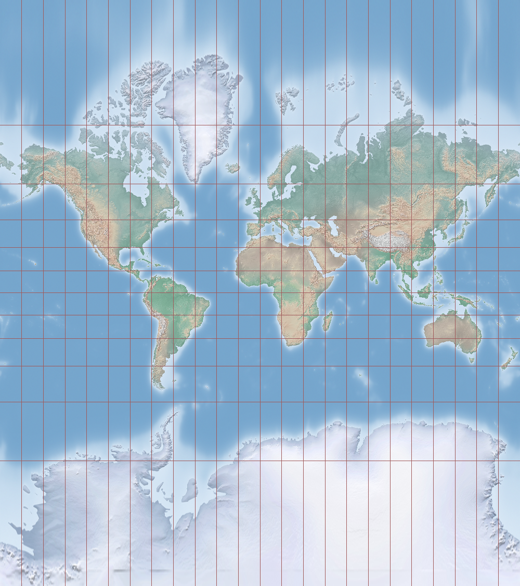
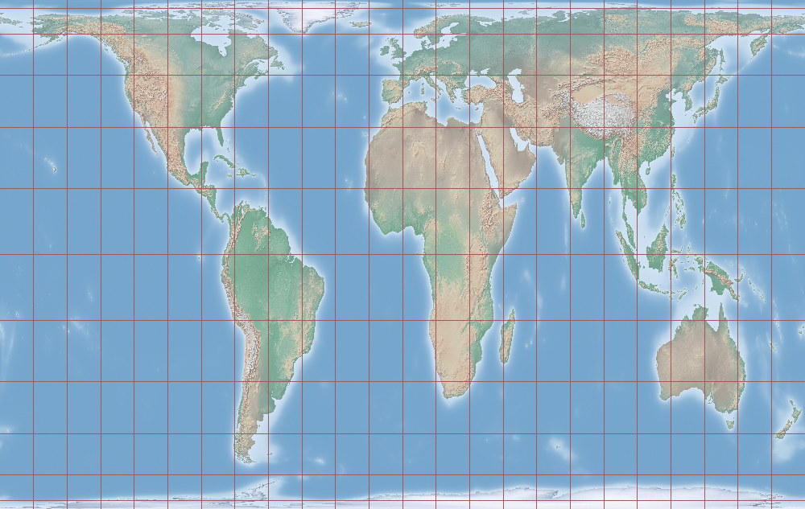
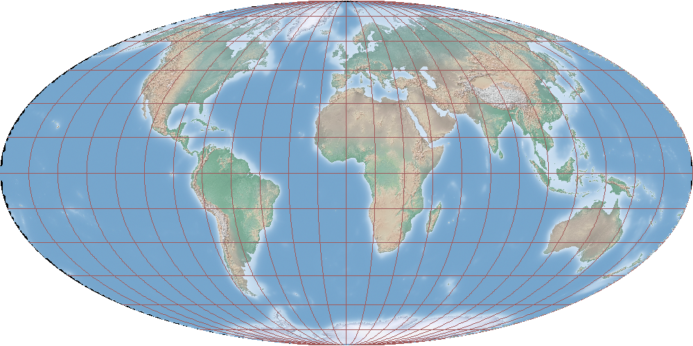

## The best map projection is one that is most obviously subjective

*What even is a 'map projection'?*

When you want to represent a 3-dimensional object, like the Earth, on a flat, 2-dimensional surface, you need to choose how you want to map the points in 3-dimensional space onto 2-dimensional space. Whatever mapping you choose defines a *projection* of those points from one surface or space onto another.

*So what makes a projection 'subjective'?*

The basic problem when projecting a higher-dimensional surface onto a lower-dimensional map is that it is mathematically impossible to correctly preserve all spatial relationships of the original object, such as the distances, angles and directions between points or the size and shape of areas. Any projection you choose implies a choice of which properties you want to preserve as much as possible (and on what part of the map), at the expense of distorting other properties (or other parts of the map).

*If all projections are necessarily subjective, isn't the best map projection simply one that distorts the fewest properties on the fewest parts of the map?*

But this leaves the question of what properties and parts of the map are most interesting to us completely unaddressed.

<!-- Let us first look at a simple 2d mapping of latitudes and longitudes in degrees.

 -->

Let's have a look at the map representation which has become the de-facto standard for world maps distributed in schools, and also for online mapping services such as Google Maps: the Mercator projection.

*Yeah I've seen that one before. Everywhere. If it's so pervasive it must be preserving some really useful properties really well, right?*

The fundamental choice at the heart of the Mercator projectionis to accurately represent *compass bearings*. The only use of this property is that if you want to go from one place on earth to another, you just look up the angle between the two points on the Mercator map, then look at a compass at your current location and simply follow the angle given by the map, which will bring you to the desired location.

But it's not even the shortest or quickest route to the destination. The shortest direct routes between two points on this map (like on most other world map projections, actually) are really curved arcs. And what's even worse, preserving this navigationally curious but otherwise pretty useless property comes at the expense of massive distortion of distances as you come closer to the poles. In fact, under the Mercator projection the North and South poles are actually infinitely far away from the center of the map. That's why Mercator maps never actually show the poles, they're normally cut off at 80 or 85 degrees. That vertical distortion is most obvious with Greenland, which looks like it's at least as big as South America, when in reality it's only 1/8th of its size.

*Your examples are contrived. Surely there must be a way to distort the fewest properties on the fewest parts of the map.*

Sure. Starting in the 1970s German Historian Arno Peters started campaigning for global institutions to adopt an *equal-area* projection for world maps, which correctly represents the *size* of areas all over the globe, at the expense of distorting their *shapes* and distances in different ways on different parts of the map.

*Wow, I didn't know Africa was this big!*

Yeah, after looking at Mercator maps all your life many people find a different look at the world refreshing and insightful. So while this projection is arguably much better than Mercator, it is still heavily distorted, just in different ways. Africa is big, but it's not shaped like that. The projection gives areas around the equator a vertically stretched appearance, while areas near the poles are both stretched horizontally and also vertically squashed!

This projection is actually only one of an entire family of projections that all preserve the relative sizes of areas, but vary in how much vertical squishing and horizontal stretching happens where. Here's another one of those that's been promoted:

*Ok I get it. Looking at these new projections gives me a much better feeling for how all world maps are subjective, and don't represent the world correctly. So let's just pick one of them and run with it?*

The insight that we derive from looking at a world map in a projection that we're not used to comes in large part from a feeling for what the continents and countries should look like, which we developed from looking at Mercator maps all our lives. That relativistic Aha! effect comes from the contrast between what we've come to expect and what we actually see. Adopting a projection that is 'good' from a utilitarian point of view diminishes our awareness that the 2-dimensional representation is actually flawed, and entrench the idea that that representation is in some way 'objectively most correct' even more robustly.

<!-- To prove my point, look at a Mercator map but Pacific-centered.

The central meridian of a map is actually an arbitrary choice, so across Asia and Oceania, this is in fact what maps used in classrooms etc look like.

Not just the central meridian of a map is arbitrary, but actually also the positioning of the two poles. It is maybe more intuitive to put the axes at the top and bottom of the page, but which of the South and North pole goes where is entirely up to the mapmaker. Lo and behold, we have uncovered a whole new world of projections, no they're not 'upside-down', they're *south-up*.

 -->

<!--  -->
